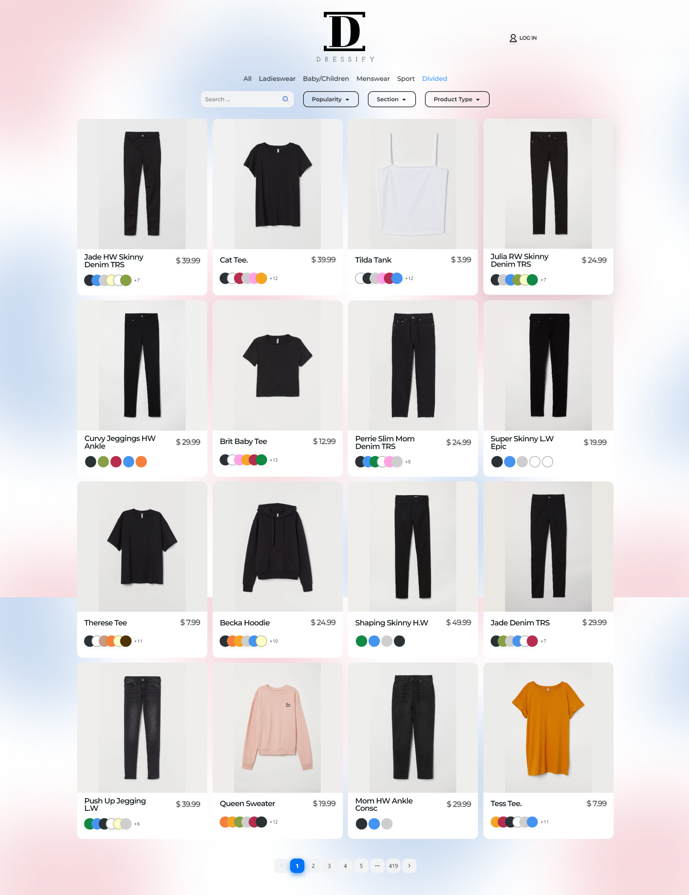
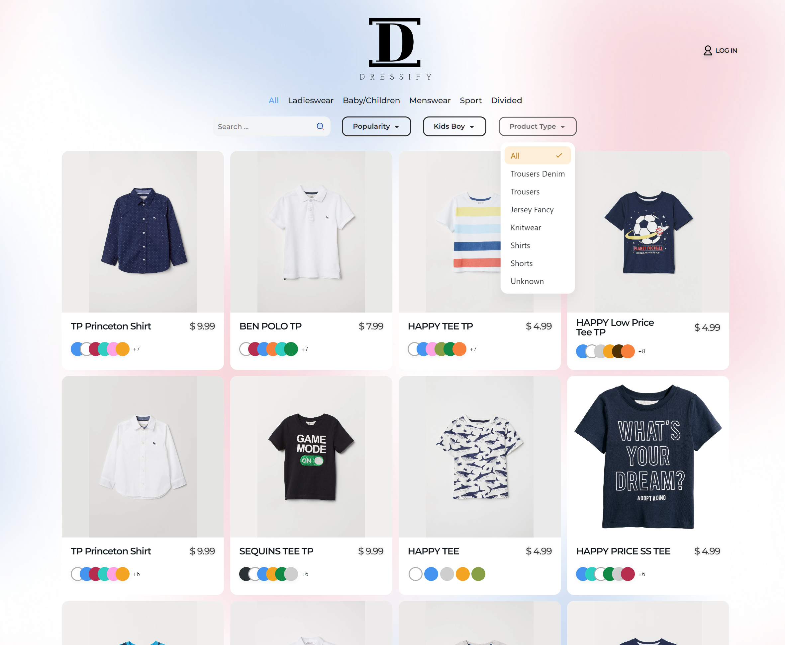
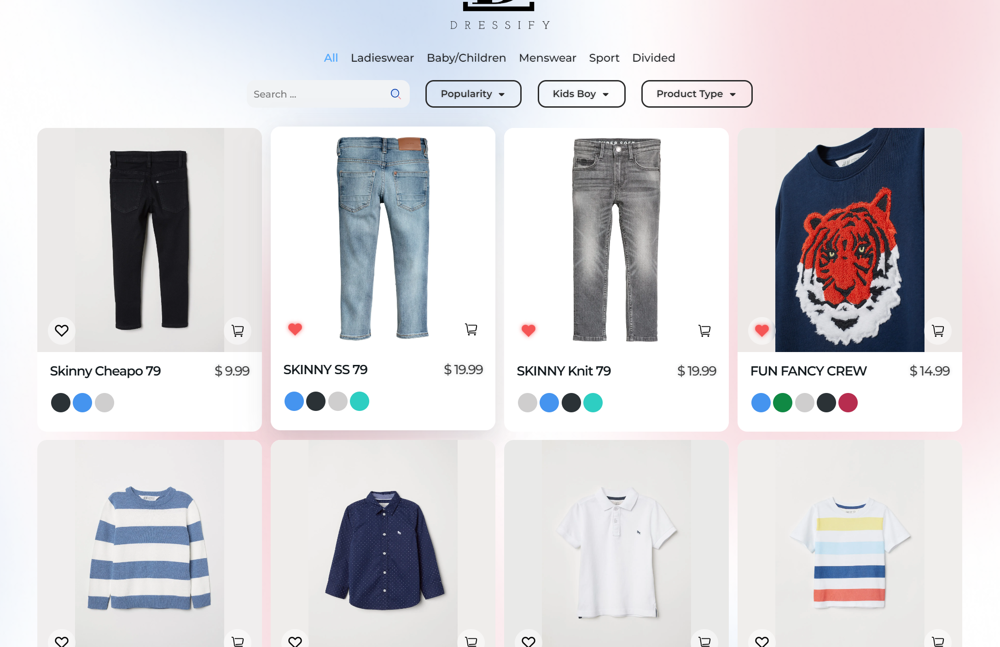
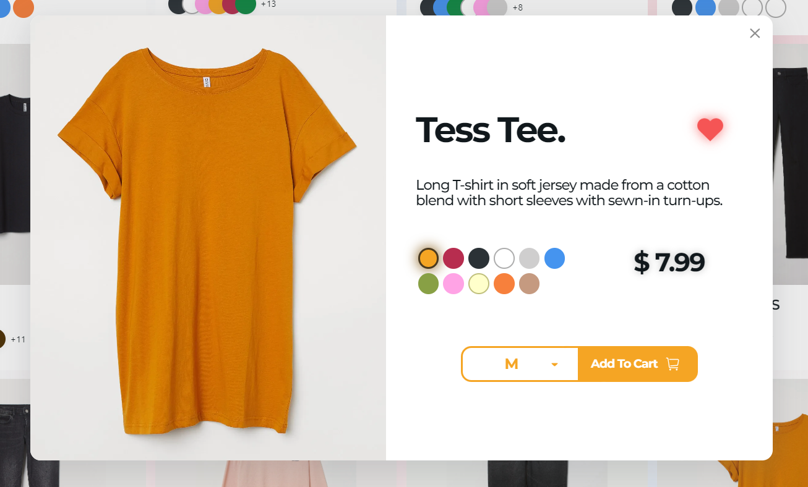
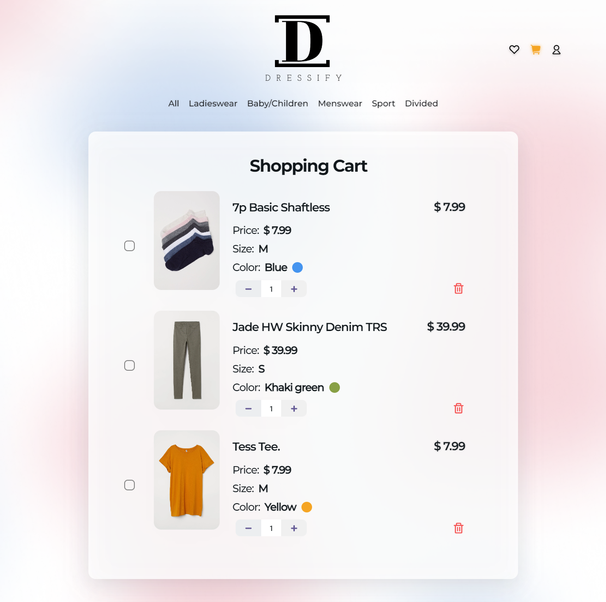
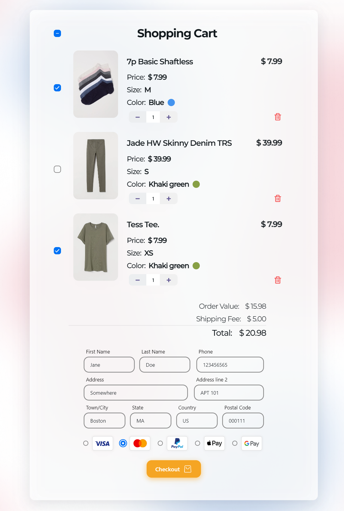
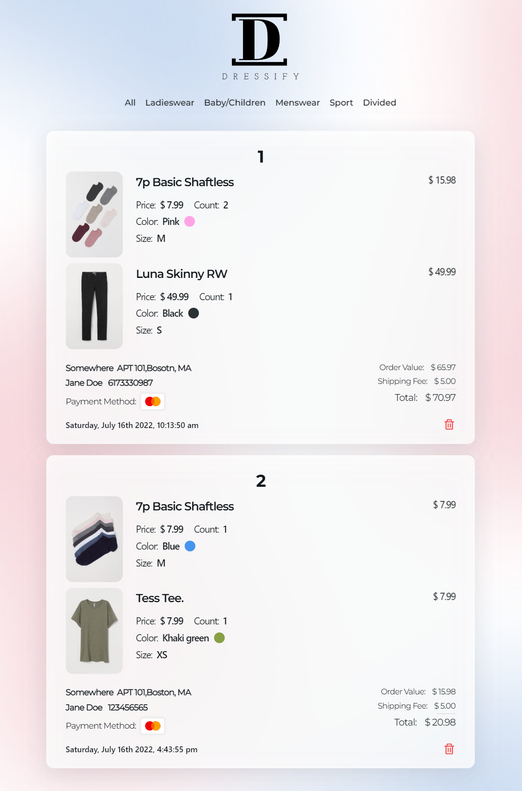
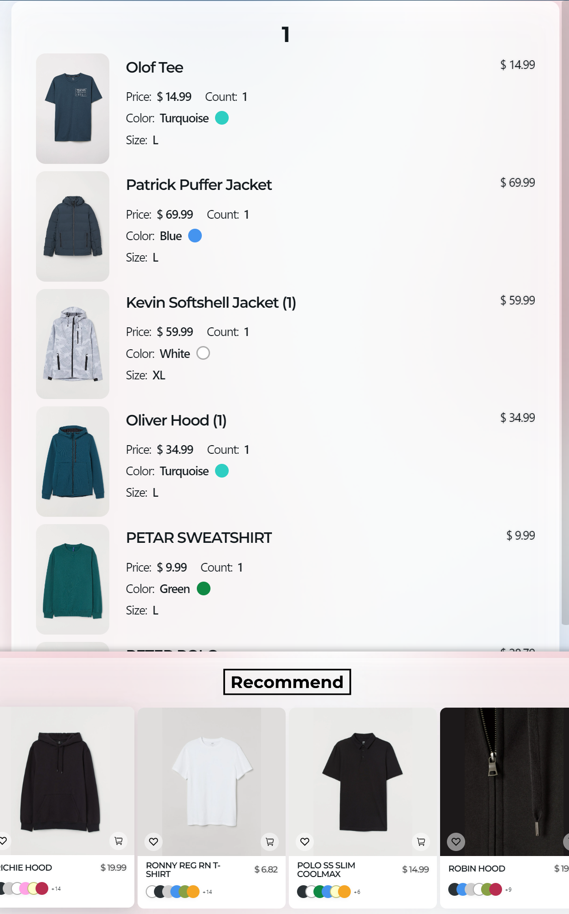
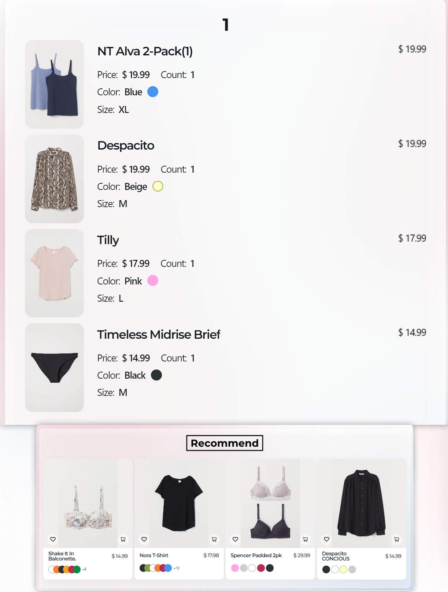

## Description

This is an online shopping website for fashion with full-featured wish list, shopping cart, checkout page, and order list.

- The backend is built with Express. Structured data is stored in MongoDB and image data is stored in an AWS S3 bucket.

- The frontend is built with React.js and NextUI.

## Homepage

The homepage contains navbar, search bar and filters, and cards of products and pagination at the bottom.

Candidate sections are based on the index that user chose at the navbar and candidate product types update dynamically based on chosen index and section.

Products can be shown in the ascending or descending order of price or the order of popularity.

Users can login with Google Account (for now). Favorite button and cart button will be shown for logined users.

## Product Detail

When clicking on a product card, a product detail card will pop over. Users can browse the pictures of different colors of the product and add the product to the shopping cart after choosing the size.

## Favorites Page

Users can view their liked products on this page.

## Shopping Cart

Users can view the products in the shopping cart on this page. They can directly modify the count of the products here.

By clicking the title of a product, a card will pop over and users can also change the color and the size of the product.

After choosing at least one product, the order calculator and checkout form will be shown below.

## History Orders

Users can view and manage their history orders on this page.

## Personalized Recommendation

Personalized recommendations will be provided for login users. Recommendations will be based on product popularity and users' historical orders.

- Case 1: A user who mostly bought men's wear and clothes for sport

- Case 2: A user who mostly bought clothes for ladies

